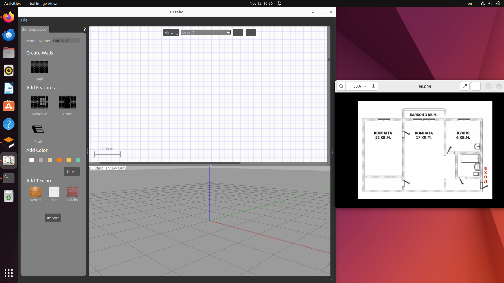
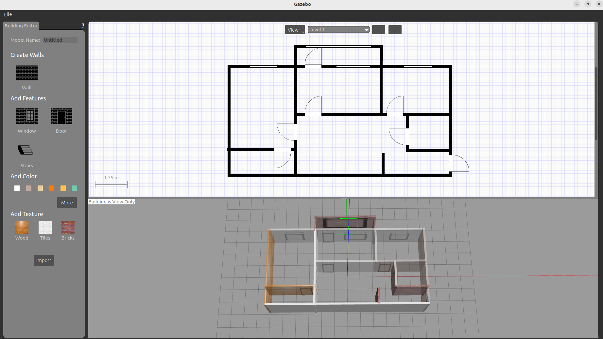
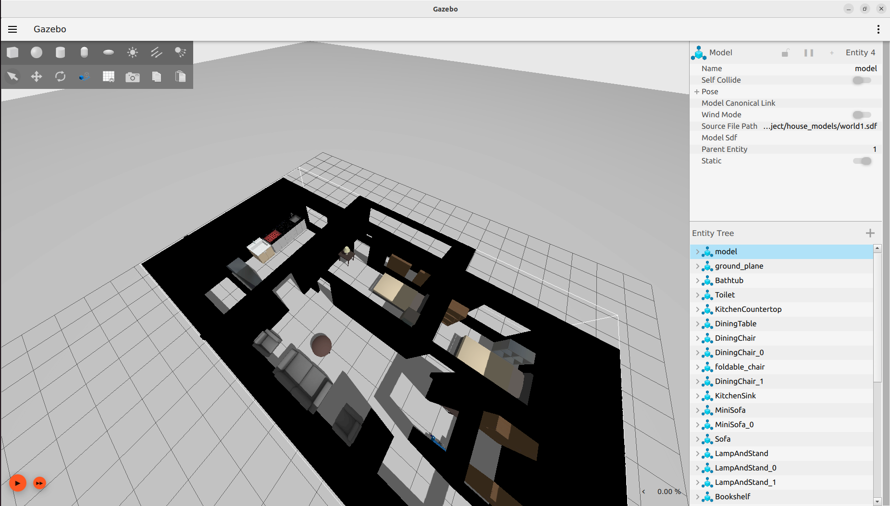
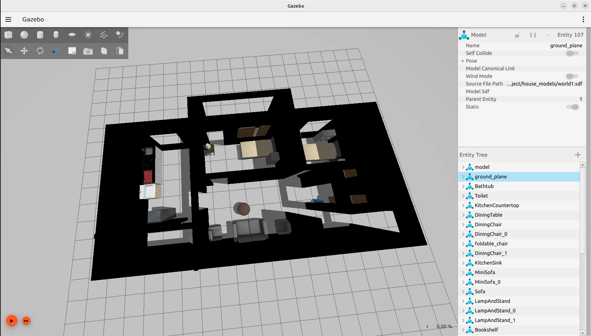
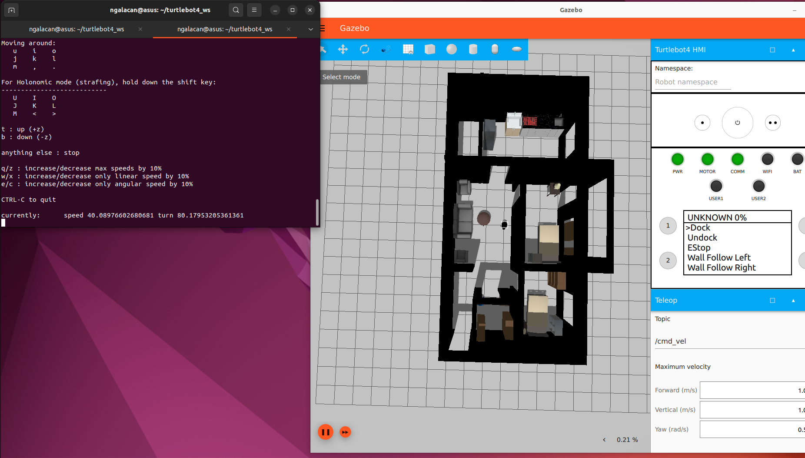

# Gazebo House ROS2
## ПО

1. Ubuntu 22.04.5 LTS jammy
2. ROS2 Humble
3. Ignition Gazebo Fortress v6.16.0
4. Gazebo Classic 11.0.0

## Создание плана квартиры в Gazebo Building Editor
1. Установка Gazebo Classic 11.0.0 (https://classic.gazebosim.org/download)
2. Запуск с помощью команды `gazebo`
3. Переход в меню Edit -> Building Editor



4. Черчение 2D-макета, используя инструменты Wall, Window, Door



5. Сохранение проекта в каталоге `house_models`

## Загрузка квартиры в Ignition Gazebo

После сохранения модели из Gazebo имеются два файла: `model.sdf` и `model.config`. 

1. Создание файла `world.sdf` в этой же папке со следующим содержанием:
```
<?xml version="1.0" ?>
<sdf version="1.6">
  <world name="default">
    <include>
      <uri>file:///home/ngalacan/house_project/house_models/model.sdf</uri> 
    </include>
  </world>
</sdf>

```
2. Открытие мира в Ignition Gazebo командой `ign gazebo world.sdf`
3. Установка в мире элементов интерьера, мебели, пола и источника света





4. Сохранение мира под тем же файлом

## Запуск симуляции с turtlebot 4
1. Создание рабочего пространства:
```
mkdir -p ~/turtlebot4_ws/src
cd ~/turtlebot4_ws/src
git clone https://github.com/turtlebot/turtlebot4.git
cd ~/turtlebot4_ws
colcon build --symlink-install
```
3. Перемещение файла `world.sdf` в `~/turtlebot4_ws/src/turtlebot4_simulator/turtlebot4_ignition_bringup/worlds`

4. Сборка: `colcon build --symlink-install`

5. Запуск симуляции в ROS2
```
ros2 launch turtlebot4_ignition_bringup turtlebot4_ignition.launch.py world:=world
```


